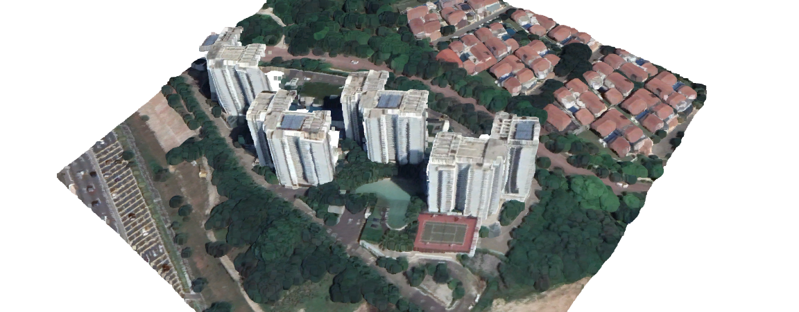
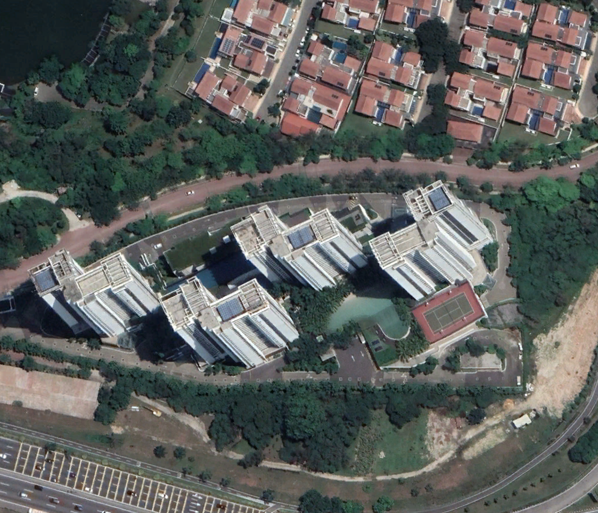
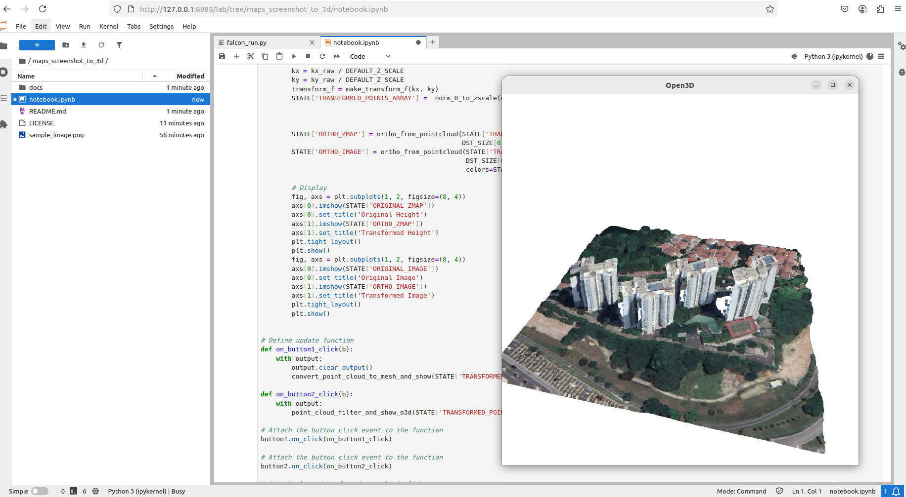

# Converting Google Maps Screenshot to 3D Model in a Single Jupyter Notebook
**This is an experimental setup, and the resulting 3D models may vary in quality — in many cases, they can look rough or distorted.**

**Recently, several high-quality monocular depth estimation models have been released, such as Apple's DepthPro. Inspired by this, I created a simple playground to experiment with generating point clouds and 3D models from aerial imagery—specifically Google Maps screenshots.**

### Screenshot requrements:
- Rectangular framing: The image should be roughly rectangular in shape to maintain alignment and avoid distortion.
- Urban content: There should be visible buildings; the algorithm removes low-contrast areas like roads, trees, or water surfaces.
- Visible facades: Buildings should be viewed at an angle so that walls are visible — this is essential for generating accurate depth and texture in the 3D model.
- Object scale: Ideally, one prominent building should occupy approximately 20% × 20% (0.2 × 0.2) of the image area for best resolution-to-structure balance.

### Pipeline Overview:
1. Load the image
2. Estimate depth and invert it to represent height instead of distance from the camera
3. Remove background using MinPool subtraction
4. "Unscrew" the perspective by applying horizontal and vertical shifts
5. Visualize the resulting mesh or point cloud

 ### Issues:
- Plotly (Web): Enables in-notebook mesh viewing, but rendering is sometimes buggy—you may need to click buttons more than once to refresh.
- Open3D (GUI): Produces smooth and high-quality point clouds, but only runs locally. On Linux systems, you may need to configure environment variables.

 ### Licensing:
 - The notebook code is released under the MIT License.
 - Model weights and dependencies are licensed by their respective authors.

